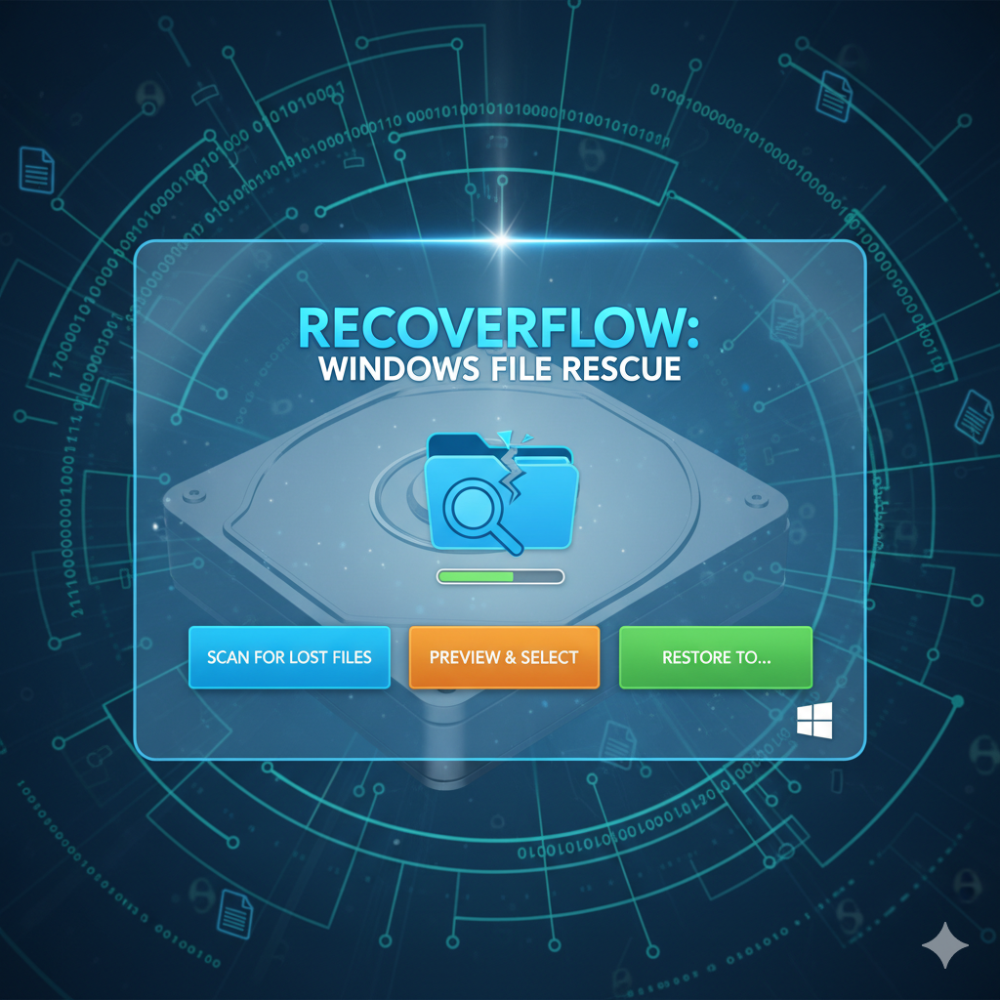

# RecoverFlow: Windows File Rescue



Un'applicazione open-source semplice e intuitiva, scritta in Python e Qt (PySide6), per recuperare file cancellati da dischi formattati o danneggiati.

## Funzionalità

- **Interfaccia Grafica Semplice:** Una schermata di avvio accattivante e un pannello di controllo chiaro.
- **Rilevamento Automatico dei Dischi:** Trova automaticamente i dischi fisici disponibili sul sistema.
- **Recupero Basato su Firme (File Carving):** Cerca e recupera tipi di file comuni, tra cui:
  - **Immagini:** JPG, PNG
  - **Documenti:** PDF, DOC, DOCX
  - **Audio/Video:** MP3, WAV, MP4
- **Barra di Progresso:** Tieni traccia dello stato di avanzamento della scansione in tempo reale.
- **Cross-Platform (Teorico):** Scritto per funzionare su Windows, Linux e macOS (richiede privilegi di amministratore/root).

---

## ⚠️ ATTENZIONE: Avviso Importante ⚠️

L'uso di strumenti di recupero dati può essere rischioso. Per massimizzare le possibilità di successo e non causare ulteriori danni:

- **NON salvare i file recuperati sullo stesso disco che stai analizzando!** Salvali sempre su un'altra unità (es. una chiavetta USB o un hard disk esterno).
- **USARE A PROPRIO RISCHIO:** Questo software è fornito "così com'è". Non mi assumo alcuna responsabilità per eventuali perdite di dati o danni al sistema derivanti dal suo utilizzo.

---

## Come si Usa (per Utenti Windows)

1.  Scarica l'ultimo file `RecoverFlow.exe` dalla sezione Releases di GitHub.
2.  Fai doppio clic su `RecoverFlow.exe`. Windows chiederà i permessi di amministratore (necessari per la scansione dei dischi).
3.  Clicca su "AVVIA SCANSIONE".
4.  Nel pannello di recupero:
    - Seleziona il disco da analizzare.
    - Scegli una cartella di destinazione **su un disco diverso**.
    - Avvia la scansione e attendi.

## Installazione da Codice Sorgente (per Sviluppatori)

Per eseguire lo script Python direttamente, hai bisogno di:
- Python 3.x
- Le seguenti librerie, installabili con `pip`:
  ```bash
  pip install PySide6 WMI
  ```
  *(WMI è necessario solo per Windows)*

Esegui lo script con privilegi elevati:
- **Windows:** `python recovery_app.py` (da un terminale avviato come amministratore).
- **Linux/macOS:** `sudo python3 recovery_app.py`.

---

## Sostieni il Progetto

Se trovi utile questa applicazione, considera di offrirmi un caffè per sostenere lo sviluppo futuro!

<a href="https://ko-fi.com/screemerss" target="_blank">
  
</a>

## Licenza

Questo progetto è rilasciato sotto la Licenza MIT. Vedi il file `LICENSE` per maggiori dettagli.